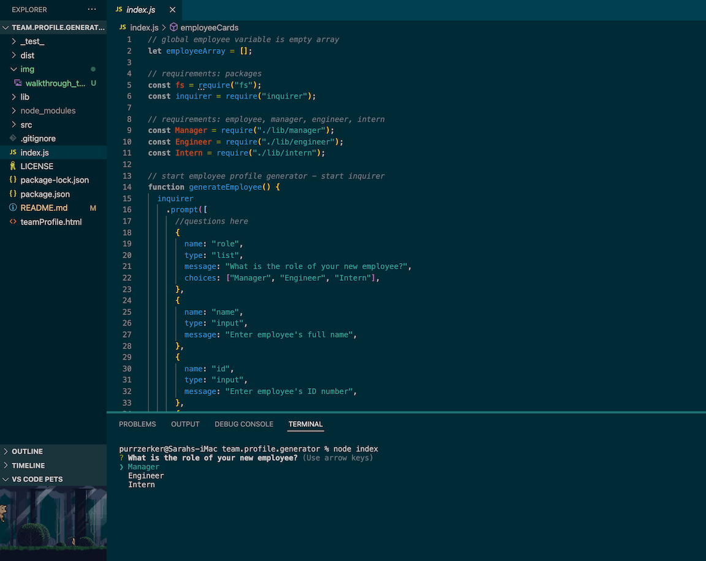
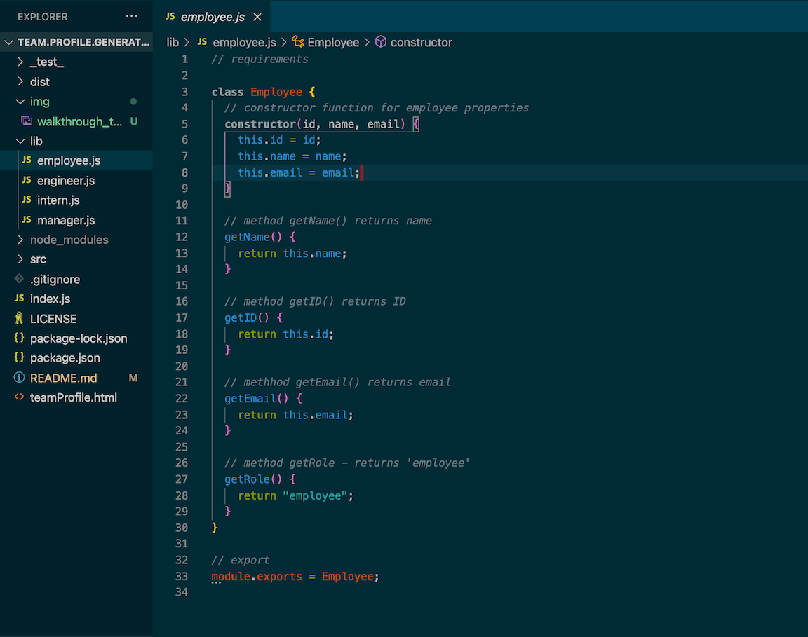
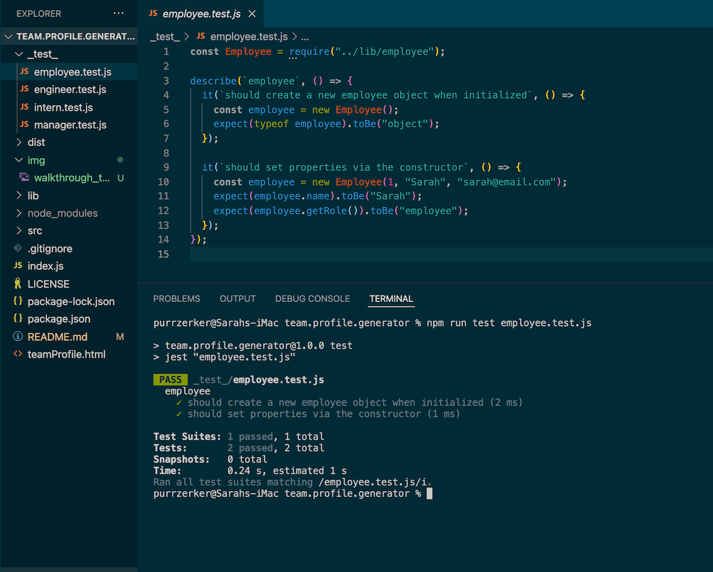

# 10: Team Profile Generator

#### Licensed under [MIT](LICENSE)

## Table of Contents

- [Project Description](#project-description)
- [Usage](#usage-instructions)
- [Testing](#testing)
- [Links](#links)

## Project Description

This node.js program uses the NPM package Inquirer to assist a user in creating basic employee profiles for a manager, engineer, and intern. The information added by the user is generated into a styled html page displaying each member of their team. This program also uses NPM package Jest to test functions

### Includes:

- Use of Inquirer and Jest NPM packages
- User-generated aesthetically pleasing and mobile-friendly webpage displaying user's input
- Functional links and email addresses in profile page based in user-input

## Usage Instructions

To start this program, open the terminal and enter <code>node index</code>. Answer all prompts thoroughly to generate your Team Profile webpage, consisting of info cards for Managers, Engineers, and Interns.

## Testing

Test this program with NPM package Jest by entering <code>npm run test testFileName </code> into an integrated terminal. Tests can be viewed in _test_ folder:

- employee.test.js
- engineer.test.js
- intern.test.js
- manager.test.js

## Links

- Repository: https://github.com/Sarahlophus/team.profile.generator
- Walkthrough video: https://drive.google.com/file/d/15dz-FKBwmyGwhXKia7TLX9fzsB79rmEq/view?usp=sharing
- Sample HTML file generated using this program: https://github.com/Sarahlophus/team.profile.generator/blob/main/teamProfile.html
